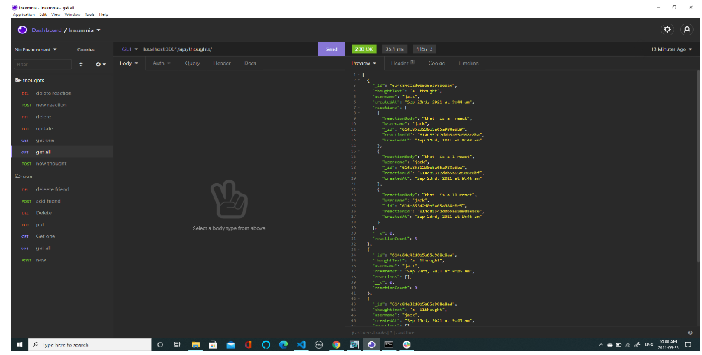

# Social network

## Description

A MongoDB/Mongoose social network backend! Watch the video to see routes in action!

## Table of Contents

- [Installation](#installation)
- [Usage](#usage)
- [Credits](#credits)
- [License](#license)
- [contributing](#contributing)
- [questions](#questions)

## Installation

Clone/Fork repo, install packages(npm install),start the server (npm start)

## Usage

To use the rotes please view the following video: https://drive.google.com/file/d/13QerpBgDJLrmejCLCKhnN4f3MWgQrQob/view?usp=sharing

## Credits

Jacob Banks

## License

This project is [MIT](https://choosealicense.com/licenses/mit/) licensed. 
Copyright © 2021 [jacob-banks](https://github.com/jacob-banks)

## Contributing

contributions welcome! fork/clone away.

## Questions

Contact Jacob Banks with any questions! 
Github link: [jacob-banks](https://github.com/jacob-banks) 
Email: kobybanks@gmail.com

video
